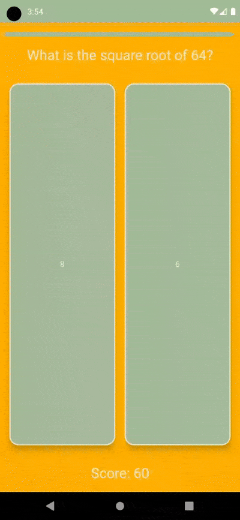

# WhichOne - Simple Quiz App

**WhichOne** app represents the main screen of a quiz application. It manages the quiz flow, displays questions, handles user interactions, and shows quiz results. The implementation utilizes Jetpack Compose for declarative UI development and Hilt for dependency injection. Below is a summary of the key features:

## Features

### Quiz Flow Management
- **Quiz Status**:
  - `ASKING_QUESTIONS`: Displays the current question and options.
  - `RESULT`: Shows the user's final score and a detailed answer review.
- **Progress Tracking**: A `LinearProgressIndicator` visualizes the remaining time to answer each question.

### Animated UI Elements
- Smooth animations for scaling question text and answer cards using `Animatable`.
- Countdown animation for the progress bar with easing effects.

### Interactive Quiz Options
- Answer options are displayed as "Flip Cards".
- Cards become disabled after selection to prevent multiple answers.
- User's score is updated based on correct answers.

### Score and Results Display
- Real-time score updates during the quiz.
- Result screen at the end displays:
  - Total score.
  - A detailed breakdown of each question, the user's answer, the correct answer, and whether the answer was correct.

### Composable Architecture
- Clean separation of UI and business logic using `HomeViewModel`.
- Reactive state management with `StateFlow` and `collectAsState`.

## How It Works

1. **Initializing Questions**:
  - `viewModel.initQuestions()` is called when the screen is launched to load questions.

2. **Displaying Questions**:
  - The current question and options are dynamically displayed.
  - Animations are triggered for the question text and options when a new question appears.

3. **User Interaction**:
  - Users select answers via `FlipCard`.
  - After selection:
    - The answer is validated.
    - The score is updated if the answer is correct.
    - Cards are disabled to prevent further interaction.

4. **Result Screen**:
  - Once all questions are answered, the result screen displays:
    - Final score.
    - List of all questions with the user's answers, correct answers, and their correctness.

## Technologies and Libraries Used

- **Jetpack Compose**: Modern UI toolkit for Android.
- **Material3**: Provides consistent styling and theming.
- **ConstraintLayout**: For adaptive and flexible UI layouts.
- **Hilt**: Dependency injection for managing ViewModel.
- **StateFlow**: For state management and reactive updates.

## Conclusion

This screen is designed to provide a fun and engaging experience for users taking the quiz, with smooth animations and interactive elements.